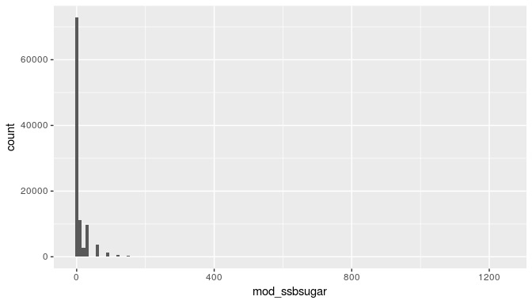
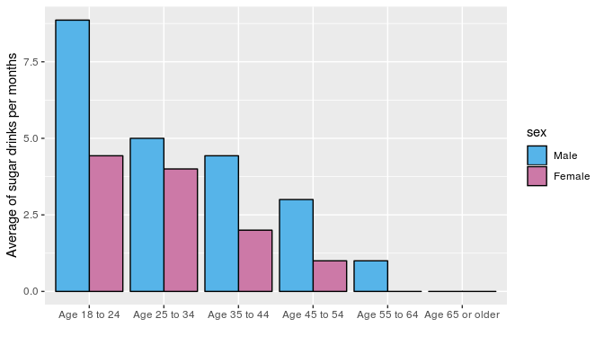
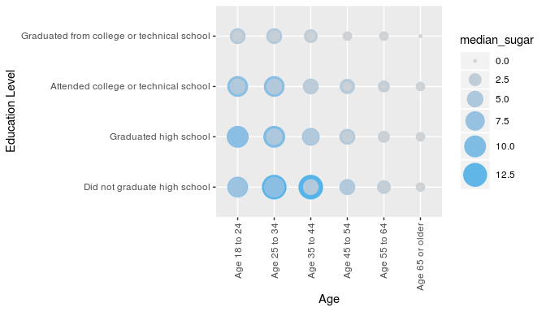
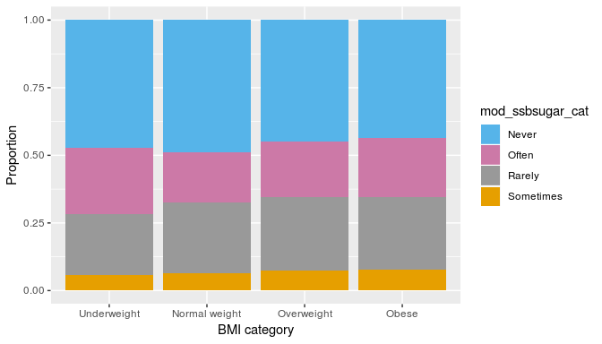
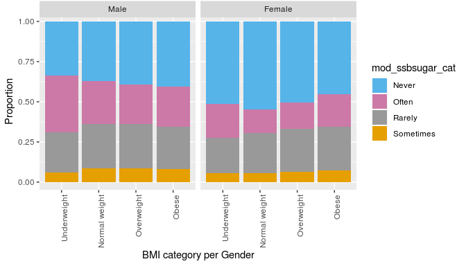

-   [Setup](#setup)
    -   [Load packages](#load-packages)
    -   [Load data](#load-data)
-   [Introduction](#introduction)
-   [Background](#background)
-   [Part 1: Data](#part-1-data)
-   [Generalizability:](#generalizability)
-   [Causality:](#causality)
-   [Part 2: Research questions](#part-2-research-questions)
-   [Part 3: Exploratory data analysis](#part-3-exploratory-data-analysis)

Setup
-----

### Load packages

``` r
library(ggplot2)
library(dplyr)
```

### Load data

``` r
load("brfss2013.RData")
```

------------------------------------------------------------------------

Introduction
------------

This is a Data Analysis Project of the Introduction to Probability and Data course by Duke University (Coursera).

Background
----------

BRFSS–a cross-sectional telephone survey that state health departments conduct monthly over landline telephones and cellular telephones with a standardized questionnaire and technical and methodologic assistance from Centers for Disease Control and Prevention (CDC). BRFSS is used to collect prevalence data among adult U.S. residents regarding their risk behaviors and preventive health practices that can affect their health status.

More information: <https://www.cdc.gov/brfss/data_documentation/index.htm>

Part 1: Data
------------

The data collected by each state individually. Up to 15 calling attempts may be made for each phone number in the sample. Rules on calling attempts are set by the CDC. In order to maintain consistency across states, the BRFSS sets standard protocols for data collection. These standards allow for state-to-state data comparison in data.

Generalizability:
-----------------

1.  Each state can modify the questionary (add, modify questions), however 2,500 interviews for each of the versions of the questionnaire is requred in order to have enough responses for weighting purposes.
2.  The BRFSS goal is to support at least 4,000 interviews per state each year. The sampling is quite big, so the data should be normally ditrubuted.
3.  Disproportionate stratified sampling (DSS) has been used for the The Landline Sampling
4.  Cellular Telephone Sample is randomly generated
5.  Data weighting is utilised to remove bias in the sample

Causality:
----------

BRFSS conducted every year to monitor long-term trends in public health, the telephone numbers are randomly chosen. This is an observational study where data is collected in a way that does not directly interfere with how the data arise. In general, observational studies can provide evidence of a naturally occurring association between variables, but they cannot by themselves show a causal connection.

------------------------------------------------------------------------

Part 2: Research questions
--------------------------

Obesity is a significant public health challenge in the United States. Sugar consumption has been associated with increased health risks. Meanwhile, the consumption level of soft drinks is very high. In this survey we will explore following questions:

1.  Explore how often the respondents drink soda drinks. Is there any difference in average consumption between age groups and sex?

2.  How does education level affect soft drink consumption?

3.  Are responses to Body Mass Index (BMI) related to the sugar drinks consumption? \* \* \*

Part 3: Exploratory data analysis
---------------------------------

**Research quesion 1: Explore how often the respondents drink soda drinks. Is there any difference in average consumption between age groups and sex?**

For the analysis we will use following variables:</br>
<ul style="list-style-type:disc">
<li>
sex - Gender
</li>
<li>
X\_age\_g - Age group
</li>
<li>
ssbsugar - How often did you drink regular soda or pop that contains sugar?
</li>
</ul>
As <i>ssbsugar</i> represents sugar drinks consumption per day/week/month, we will need to transform variable. We will create a new variable mod\_ssbsugar with monthly consumtion. Also, we will supress observations with empty response.

``` r
data1 <- brfss2013 %>% 
  select(sex, X_age_g, ssbsugar) %>%
  filter(!(is.na(sex)), !(is.na(X_age_g)), !(is.na(ssbsugar))) %>%
  mutate(mod_ssbsugar = case_when(ssbsugar %in% 100:199 ~ (ssbsugar - 100) * 31,
                                  ssbsugar %in% 200:299 ~ (ssbsugar - 200) * 4.43,
                                  ssbsugar %in% 300:399 ~ (ssbsugar - 300),
                                  ssbsugar < 100 ~ 0)
    ) 

# The palette 
cbPalette <- c("#56B4E9", "#CC79A7")
```

Let's have a look how many observations we have:

``` r
dim(data1)
```

    ## [1] 103192      4

We can examine the distribution of sugar drinks consumtipn with a histogram.

``` r
ggplot(data = data1, aes(x = mod_ssbsugar)) +
  geom_histogram(binwidth = 10)
```



The histogram is the right skewed, so we have to get rid off outlier. Let's have a look how many observation we have with a consumption over 90 drinks per months.

``` r
data1 %>% 
  filter(mod_ssbsugar >= 90) %>%
  summarise(mean_dd = mean(mod_ssbsugar), max_sugar = max(mod_ssbsugar), median_sugar = median(mod_ssbsugar), count = n())
```

    ##    mean_dd max_sugar median_sugar count
    ## 1 133.9837      1240       106.32  2769

Maimum of 1240 soda drinks per month sounds unreal. In total we have 2769 out of 103192 observations to supress, which is less than 2.5% of the data set. Let's supress the outliers:

``` r
data1 <- data1 %>% 
  filter(mod_ssbsugar < 90) 
dim(data1)
```

    ## [1] 100423      4

Now, we can aggregate te data set to find average and median consumption per month:

``` r
data1_stat <- data1 %>%
  group_by(sex, X_age_g) %>%
  summarise(mean_dd = mean(mod_ssbsugar), sd_sugar = sd(mod_ssbsugar), median_sugar = median(mod_ssbsugar))
```

We can now visualize the distribution of sugar drinks consumption across gender and age group using a bar plot:

``` r
ggplot(data1_stat, aes(x = factor(X_age_g, ordered=FALSE), y = median_sugar)) + 
  geom_bar(aes(fill=sex),   # fill depends on cond2
           stat="identity",
           colour="black",    # Black outline for all
           position=position_dodge()) +
  scale_fill_manual(values=cbPalette) +
  xlab("") +
  ylab ("Average of sugar drinks per months") 
```



</br></br><b>Conclusion: </b> Obviously young people consume more soda drinks. Also, female drinnks less sugar drinks than men.

**Research quesion 2: How does education level affect soft drink consumption?**

For the analysis we will use following variables:</br>
<ul style="list-style-type:disc">
<li>
sex - Gender
</li>
<li>
X\_age\_g - Age group
</li>
<li>
ssbsugar - How often did you drink regular soda or pop that contains sugar?
</li>
<li>
X\_educag - Level Of Education Completed Categories
</li>
</ul>
As <i>ssbsugar</i> represents sugar drinks consumption per day/week/month, we will need to transform variable. We will create a new variable mod\_ssbsugar with monthly consumtion. Also, we will supress observations with empty response. In addition, we supress mod\_ssbsugar outlier as we did in the previous chapter.

``` r
data2 <- brfss2013 %>% 
  select(sex, X_age_g, X_educag, ssbsugar) %>%
  filter(!(is.na(sex)), !(is.na(X_age_g)), !(is.na(ssbsugar)), !(is.na(X_educag))) %>%
  mutate(mod_ssbsugar = case_when(ssbsugar %in% 100:199 ~ (ssbsugar - 100) * 31,
                                  ssbsugar %in% 200:299 ~ (ssbsugar - 200) * 4.43,
                                  ssbsugar %in% 300:399 ~ (ssbsugar - 300),
                                  ssbsugar < 100 ~ 0)
    ) %>% 
  filter(mod_ssbsugar < 90)
```

To see a correlation between education level and sugar consumption, let's use a point plot

``` r
data2_stat <- data2 %>% group_by(sex, X_age_g, X_educag) %>%
  summarise(median_sugar = median(mod_ssbsugar))
            
ggplot(data2_stat, aes(x = X_age_g , y = X_educag, color = median_sugar, size = median_sugar))+
     geom_point (aes(color = median_sugar, size = median_sugar)) +
     theme(axis.text.x = element_text(angle = 90, vjust = 0.5, hjust=1))+ 
     xlab("Age") +
     ylab ("Education Level") +
     scale_colour_gradient(low = "lightgrey", high = "#56B4E9") + 
     scale_size(range=c(1,10)) +
     guides(color=guide_legend(), size = guide_legend())
```

 </br></br><b>Conclusion: </b>As you can see, young people drinks more sugar beverages. Also, respondents who graduated college and techical school consume less drinks.

**Research quesion 3: Are responses to Body Mass Index (BMI) related to the sugar drinks consumption?**

For the analysis we will use following variables:</br>
<ul style="list-style-type:disc">
<li>
sex - Gender
</li>
<li>
X\_age\_g - Age group
</li>
<li>
ssbsugar - How often did you drink regular soda or pop that contains sugar?
</li>
<li>
X\_bmi5cat - Body Mass Index (BMI) Categories
</li>
</ul>
</br> As <i>ssbsugar</i> represents sugar drinks consumption per day/week/month, we will need to transform variable. We will create a new variable mod\_ssbsugar with monthly consumtion. Also, we will supress observations with empty response. In addition, we supress mod\_ssbsugar outlier as we did in the previous chapter.

``` r
data3 <- brfss2013 %>% 
  select(sex, X_age_g, X_bmi5cat, ssbsugar) %>%
  filter(!(is.na(sex)), !(is.na(X_age_g)), !(is.na(ssbsugar)), !(is.na(X_bmi5cat))) %>%
  mutate(mod_ssbsugar = case_when (ssbsugar %in% 100:199 ~ (ssbsugar - 100) * 31,
                                   ssbsugar %in% 200:299 ~ (ssbsugar - 200) * 4.43,
                                   ssbsugar %in% 300:399 ~ (ssbsugar - 300),
                                   ssbsugar < 100 ~ 0)
    ) %>% 
  filter(mod_ssbsugar < 90) 
```

Now we need to categorise sugar consumption:

``` r
data3 <- data3 %>% 
  mutate(mod_ssbsugar_cat = case_when (mod_ssbsugar == 0 ~ 'Never',
                                       mod_ssbsugar >= 1 & mod_ssbsugar < 6~ 'Rarely',
                                       mod_ssbsugar >= 6 & mod_ssbsugar < 11 ~ 'Sometimes',
                                       mod_ssbsugar >= 11 ~ 'Often'))
```

Let's have a look if there is a correlation between BMI and soda drinks consumtion. As you can see, overweight and obese respondent do not consume more soda than others.

``` r
prop.table(table(data3$mod_ssbsugar_cat,data3$X_bmi5cat),2)
```

    ##            
    ##             Underweight Normal weight Overweight      Obese
    ##   Never      0.47191737    0.48834015 0.45052522 0.43424850
    ##   Often      0.24661072    0.18703680 0.20393477 0.22087293
    ##   Rarely     0.22530665    0.26019039 0.27180663 0.26722985
    ##   Sometimes  0.05616527    0.06443266 0.07373339 0.07764872

``` r
# Palette
cbPalette <- c("#56B4E9", "#CC79A7", "#999999", "#E69F00", "#009E73")
```

Let's use a bar plot to visualise the outcome:

``` r
ggplot(data3) + aes(x=X_bmi5cat, fill=mod_ssbsugar_cat) + 
     geom_bar(position = "fill") + 
     xlab("BMI category") + 
     ylab("Proportion") + 
     scale_fill_discrete(name="Reported Health") +
     scale_fill_manual(values=cbPalette)
```

    ## Scale for 'fill' is already present. Adding another scale for 'fill',
    ## which will replace the existing scale.



``` r
ggplot(data3) + aes(x=X_bmi5cat,fill=mod_ssbsugar_cat) + 
     geom_bar(position = "fill") + 
     facet_grid(.~sex) +
     xlab("BMI category per Gender") + ylab("Proportion") + scale_fill_discrete(name="Reported Health") +
     scale_fill_manual(values=cbPalette) +
     theme(axis.text.x = element_text(angle = 90, hjust = 1))
```

    ## Scale for 'fill' is already present. Adding another scale for 'fill',
    ## which will replace the existing scale.



</br><b>Conclusion: </b> There is no correlation betwwen sugar drink consumption and BMI. However, women usualy drink less soda drinks.
